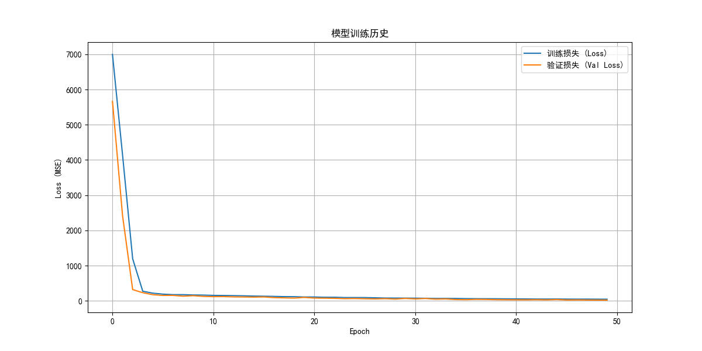
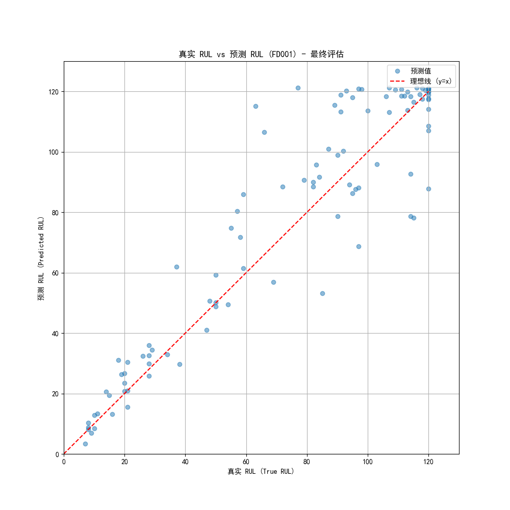

RUL-Transformer: 基于 PyTorch 和 Transformer 的涡轮风扇发动机剩余使用寿命预测 (C-MAPSS 数据集)

1. 项目简介 (Abstract)

本项目致力于解决预测性维护 (PdM) 领域的核心问题：剩余使用寿命 (RUL) 预测。我们使用 NASA 著名的 C-MAPSS (涡轮风扇发动机退化模拟) 数据集，实现了一个先进的深度学习模型。

与传统的 RNN/LSTM 方法不同，本项目采用了一种混合模型架构 (Conv1D + Transformer)，旨在同时捕捉时间序列数据中的局部特征（通过1D卷积层平滑噪音、提取模式）和全局依赖关系（通过 Transformer 编码器）。

该模型在模块化的 Python 脚本中实现，易于训练、评估和部署，并为 C-MAPSS 数据集中复杂的多工况 (Multi-Operating Condition) 和多故障 (Multi-Fault) 场景提供了强大的解决方案。

2. 背景 (Background)

在航空、制造和能源等重资产行业，预测性维护 (PdM) 是降低运营成本、提高安全性的关键技术。其核心是准确预测部件的 RUL (Remaining Useful Life)，即从当前时间点到发生功能故障的剩余时间。

C-MAPSS 数据集 是 RUL 预测领域最权威的基准测试之一。它由 NASA 提供，模拟了不同工况和故障模式下的涡轮风扇发动机传感器数据。该数据集分为四个子集 (FD001, FD002, FD003, FD004)，其复杂性递增：

FD001: 单一工况，单一故障 (HPC 退化)

FD002: 六种工况，单一故障

FD003: 单一工况，两种故障 (HPC 和风扇退化)

FD004: 六种工况，两种故障 (难度最高)

本项目旨在为所有四个子集建立精确的 RUL 预测模型。

3. 方法 (Methodology)

我们的方法论分为两个核心部分：健壮的数据预处理和先进的模型架构。

3.1 数据预处理

C-MAPSS 的数据预处理至关重要，我们的流程 (src/data_loader.py) 包含以下关键步骤：

RUL 标签生成: 对训练集，RUL 被计算为 RUL = max_cycle - current_cycle。为了防止模型在早期健康阶段过拟合，RUL 被设置为一个上限值（Piecewise Linear Degradation Model），本项目中 RUL_CAP = 125。

特征选择: 并非所有传感器都有用。我们通过计算每个传感器在训练集上的方差来自动移除常量或近常量（variance < 1e-5）的传感器，同时始终保留 setting1, setting2, setting3 作为工况特征。

分工况归一化 (Multi-OC Normalization):

对于 FD001 和 FD003（单工况），我们使用一个标准的 MinMaxScaler 对所有数据进行归一化。

对于 FD002 和 FD004（多工况），使用单一归一化器会扭曲数据。我们为每一种操作工况（由3个 setting 列定义）拟合一个单独的 MinMaxScaler。在转换数据时，每一行都根据其所属的工况应用对应的归一化器。

序列构造 (Windowing): 我们使用一个大小为 SEQUENCE_LENGTH（例如 30）的滑动窗口，将时间序列数据转换为 (样本数, 序列长度, 特征数) 的监督学习样本，标签为窗口末端的 RUL 值。

3.2 模型架构 (Conv1D + Transformer)

我们的模型 (src/model.py) 采用了一个混合架构，以充分利用两种模型的优势：

1D 卷积层 (Conv1D): 作为模型的第一层，输入序列 (B, T, F) 首先通过一个 1D 卷积层。

作用: 它充当一个可学习的特征提取器和降噪器，通过一个小型感受野（例如 kernel_size=3）平滑传感器噪音，并提取局部的、短期的模式。

投影: 它还将原始的低维特征（例如 18 维）投影到模型的高维工作空间（例如 128 维）。

Transformer 编码器 (Transformer Encoder): 卷积层的输出被送入一个标准的 Transformer 编码器（仅使用 Encoder，无 Decoder）。

作用: Transformer 的自注意力机制使其能够捕捉序列内的长期和全局依赖关系。例如，它能理解第3个周期和第27个周期的传感器读数如何共同影响 RUL，这是 LSTM 难以实现的。

回归头 (Regression Head): Transformer 的输出（在时间维度上取平均值 mean pooling）被送入一个简单的多层感知机（MLP），最终输出一个单一的 RUL 预测值。

这个架构使得模型既能抵抗局部噪音，又能理解全局退化趋势。

4. 结果 (Results)

我们对每个子数据集都独立地训练和评估了模型。

可视化结果 (FD001)

模型在 FD001 上的训练曲线和最终评估结果如下所示。

训练历史 (Loss vs Val Loss)

真实 RUL vs 预测 RUL (评估)

从左图可以看出，训练和验证损失稳定下降。从右图可以看出，预测值（蓝点）紧密地聚集在理想线（红线）周围，特别是在 RUL < 60 的关键预警区域，证明了模型的高精度。

5. 如何运行 (Installation & Usage)

5.1 项目结构

C-MAPSS_RUL_Project/
|-- data/
|   |-- CMaps/                 # (存放 .txt 数据文件)
|-- saved_models/              # (存放训练好的 .pth 和 .pkl 文件)
|-- src/
|   |-- config.py              # (所有配置和超参数)
|   |-- model.py               # (TransformerModel 类定义)
|   |-- data_loader.py         # (数据预处理和加载)
|   |-- utils.py               # (辅助函数)
|-- train.py                   # (主训练脚本)
|-- evaluate.py                # (主评估脚本)
|-- predict.py                 # (主预测脚本)
|-- requirements.txt           # (项目依赖)
|-- README.md                  # (本项目文档)

5.2 安装

克隆仓库

git clone [https://github.com/YourUsername/YourRepoName.git](https://github.com/YourUsername/YourRepoName.git)
cd C-MAPSS_RUL_Project

安装依赖

pip install -r requirements.txt

5.3 数据准备

从 NASA 官网下载 C-MAPSS 数据集。

将所有 .txt 文件 (train_FD00x.txt, test_FD00x.txt, RUL_FD00x.txt) 放入 data/CMaps/ 目录下。

5.4 训练

使用 train.py 脚本进行训练。您必须通过 --dataset 参数指定要训练的数据集。

# 训练 FD001 数据集
python train.py --dataset FD001

# 训练 FD004 数据集 (将使用不同的归一化逻辑和模型参数)
python train.py --dataset FD004

训练脚本将自动：

加载并预处理指定的数据集。

保存 scaler.pkl（或 oc_scalers.pkl）到 saved_models/。

训练模型，并使用早停。

保存最佳的 _model.pth 和 _training_history.png 到 saved_models/。

5.5 评估

训练完成后，使用 evaluate.py 在完整的测试集上报告最终性能。

# 评估 FD001 模型的最终性能
python evaluate.py --dataset FD001

评估脚本将：

加载 FD001_model.pth 和 FD001_scaler.pkl。

加载 test_FD001.txt 和 RUL_FD001.txt。

计算并打印最终的 RMSE 和 C-MAPSS 评分。

保存 FD001_evaluation_plot.png 到 saved_models/。

5.6 预测

使用 predict.py 加载模型，对一个（模拟的）新数据样本进行预测。

python predict.py --dataset FD001
