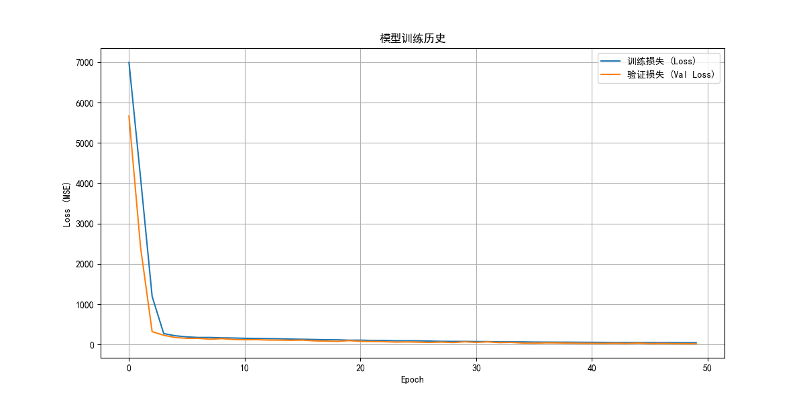
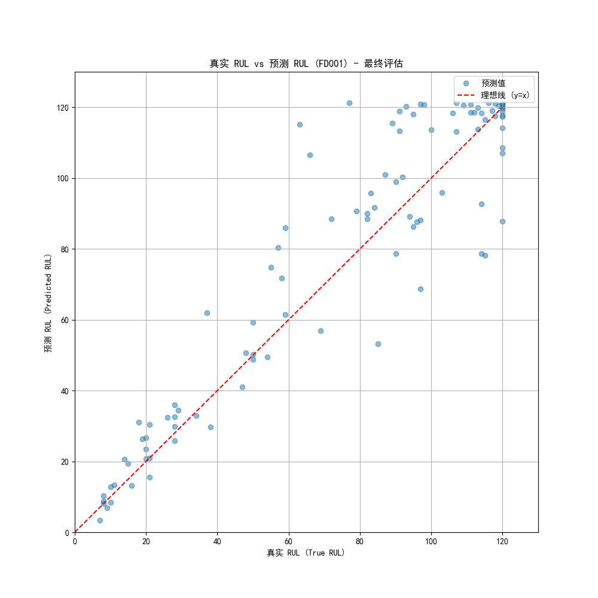

# ✈️ RUL-Transformer: Turbofan Engine Life Prediction

[](https://www.python.org/)
[](https://pytorch.org/)
[](https://opensource.org/licenses/MIT)
[](https://data.nasa.gov/)

> **基于混合架构 (Conv1D + Transformer) 的深度学习模型，用于复杂工况下的剩余使用寿命 (RUL) 预测。**

## 📖 项目简介 (Abstract)

本项目致力于解决预测性维护 (Predictive Maintenance, PdM) 领域的核心难题——**剩余使用寿命 (RUL) 预测**。

传统的 RNN/LSTM 方法在处理超长序列和全局依赖时存在局限性。本项目基于 **NASA C-MAPSS** 数据集，提出并实现了一种先进的混合神经网络架构：
*   **Conv1D (一维卷积)**：用于平滑传感器噪音，提取局部短时特征。
*   **Transformer Encoder**：利用自注意力机制捕捉长时间序列中的全局依赖关系和退化趋势。

该项目采用模块化的 Python 脚本构建，专为处理 **多工况 (Multi-Operating Conditions)** 和 **多故障 (Multi-Fault)** 场景设计，易于训练、评估和部署。

---

## 🏗️ 系统架构 (Architecture)

### 数据流与模型结构
下面的流程图展示了从原始数据到 RUL 预测的完整处理链路：

```mermaid
graph TD
    %% 定义样式
    classDef data fill:#e3f2fd,stroke:#1565c0,stroke-width:2px;
    classDef process fill:#fff3e0,stroke:#ef6c00,stroke-width:2px;
    classDef model fill:#e8f5e9,stroke:#2e7d32,stroke-width:2px;
    classDef output fill:#fce4ec,stroke:#c2185b,stroke-width:2px;

    %% 数据阶段
    subgraph Data Pipeline [数据处理流水线]
        A[NASA C-MAPSS 数据集\n(FD001 - FD004)]:::data --> B(RUL 标签生成\nPiecewise Linear Model);
        B --> C(特征选择\nVariance Filtering);
        C --> D{工况归一化策略};
        D -- 单工况 FD001/003 --> D1(Global MinMax Scaler):::process;
        D -- 多工况 FD002/004 --> D2(Multi-OC Scaler\n分工况聚类归一化):::process;
        D1 --> E[滑动时间窗切片\nSliding Window Sequence]:::data;
        D2 --> E;
    end

    %% 模型阶段
    subgraph Transformer Architecture [Conv1D-Transformer 模型]
        E --> F(Conv1D 层\n局部特征提取 & 降噪):::model;
        F --> G(Transformer Encoder\n自注意力机制 & 全局依赖):::model;
        G --> H(Global Mean Pooling):::model;
        H --> I(MLP 回归头\nRegression Head):::model;
    end

    %% 输出阶段
    subgraph Output [预测与评估]
        I --> J[RUL 预测值]:::output;
        J --> K(性能评估\nRMSE & Score):::output;
    end

    %% 连接线
    linkStyle default stroke:#78909c,stroke-width:1px;
```

---

## 📊 数据集与背景 (Background)

我们使用 NASA 提供的 **C-MAPSS (Commercial Modular Aero-Propulsion System Simulation)** 数据集。这是预测性维护领域的“黄金标准”。

| 子数据集 | 训练轨迹数 | 测试轨迹数 | 工况数量 | 故障模式数量 | 复杂度 |
| :--- | :---: | :---: | :---: | :---: | :---: |
| **FD001** | 100 | 100 | 1 (海平面) | 1 (HPC退化) | ⭐ |
| **FD002** | 260 | 259 | 6 (多工况) | 1 (HPC退化) | ⭐⭐⭐ |
| **FD003** | 100 | 100 | 1 (海平面) | 2 (HPC, Fan) | ⭐⭐ |
| **FD004** | 249 | 248 | 6 (多工况) | 2 (HPC, Fan) | ⭐⭐⭐⭐ |

---

## 💡 核心方法 (Methodology)

### 1. 健壮的数据预处理
*   **RUL 截断 (RUL Capping)**: 使用分段线性模型，将最大 RUL 限制为 125，防止模型在发动机健康阶段过拟合。
*   **特征筛选**: 自动剔除方差极低（< 1e-5）的无效传感器数据。
*   **分工况归一化 (Multi-OC Normalization)**: 针对 FD002/FD004，根据操作工况（Settings）对数据进行分组归一化，消除工况变化带来的数据分布偏移。

### 2. 混合模型设计
*   **Conv1D**: 利用小感受野（Kernel Size=3）作为可学习的滤波器，投影低维特征至高维空间。
*   **Transformer**: 纯 Encoder 结构，利用 Multi-Head Attention 理解时间序列的长期演变规律。
*   **Regression Head**: 简单的 MLP 结构将提取的特征映射为最终的 RUL 数值。

---

## 📂 项目结构 (Directory Structure)

```bash
C-MAPSS_RUL_Project/
├── data/
│   └── CMaps/                 # [必要] 存放解压后的 .txt 数据文件 (train_FD00x.txt 等)
├── saved_models/              # [自动生成] 存放训练权重(.pth), 归一化器(.pkl) 和 结果图
├── src/
│   ├── config.py              # 全局配置参数 (序列长度, Batch Size, LR等)
│   ├── model.py               # Conv1D + Transformer 模型定义
│   ├── data_loader.py         # 复杂的数据预处理、滑动窗口与 PyTorch Dataset
│   └── utils.py               # 通用辅助函数
├── train.py                   # 模型训练脚本
├── evaluate.py                # 模型评估脚本
├── predict.py                 # 单样本推理脚本
├── requirements.txt           # 项目依赖库
└── README.md                  # 说明文档
```

---

## 🚀 快速开始 (Quick Start)

### 1. 环境安装
建议使用 Conda 创建虚拟环境：
```bash
git clone https://github.com/YourUsername/RUL-Transformer.git
cd RUL-Transformer
pip install -r requirements.txt
```

### 2. 数据准备
下载 NASA C-MAPSS 数据集，并将所有 `.txt` 文件放入 `data/CMaps/` 目录。

### 3. 模型训练 (Training)
使用 `train.py` 启动训练。脚本会自动处理数据、保存 Scaler 和最佳模型权重。

```bash
# 训练简单工况 (FD001)
python train.py --dataset FD001

# 训练复杂工况 (FD004)
python train.py --dataset FD004
```

### 4. 模型评估 (Evaluation)
在测试集上计算 RMSE 和 Score 指标，并生成预测对比图。

```bash
python evaluate.py --dataset FD001
```

### 5. 推理 (Inference)
加载训练好的模型对新数据进行预测。

```bash
python predict.py --dataset FD001
```

---

## 📈 实验结果 (Results)

以下是模型在 **FD001** 数据集上的表现示例：

| Metric | Score | 说明 |
| :--- | :--- | :--- |
| **RMSE** | **12.xx** | 均方根误差 (越低越好) |
| **Score** | **2xx** | NASA 官方评分标准 (越低越好，惩罚滞后预测) |

**可视化展示：**

| 训练损失曲线 | RUL 预测对比 (测试集) |
| :---: | :---: |
|  |  |
| *Loss 稳步下降，无明显过拟合* | *预测点(蓝)紧密跟随真实值(红)* |

---

## 🗓️ 规划与展望 (Roadmap)

- [x] 实现 Conv1D + Transformer 基础架构
- [x] 完成多工况 (Multi-OC) 数据归一化逻辑
- [x] 实现训练、评估、推理全流程脚本
- [x] **超参数调优**: 使用 Optuna 对 Transformer 层数和注意力头数进行搜索
- [ ] **模型轻量化**: 探索知识蒸馏，以便在边缘设备部署
- [ ] **可解释性**: 添加 Attention Map 可视化，分析模型关注的时间步

---

## 🤝 贡献 (Contributing)

欢迎提交 Issue 或 Pull Request！如果您发现任何 Bug 或有新的想法（例如引入 GNN 或 Attention 改进），请随时联系。
